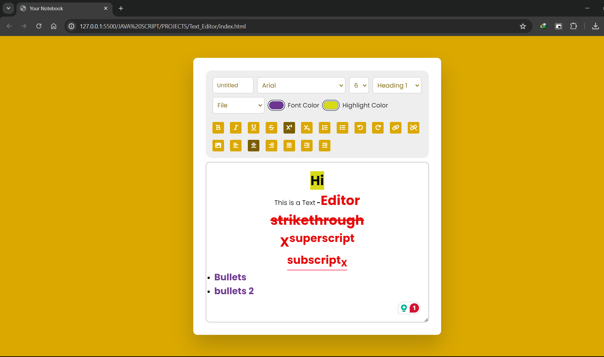

# Your-Notebook
Your Notebook is a web-based Rich Text Editor. It provides a simple and efficient platform for users to create, edit, and save text documents directly from their browser.

## Table of Contents
- [Introduction](#introduction)
- [Features](#features)
- [Getting Started](#getting-started)
- [Contributing](#contributing)
- [License](#license)

## Introduction
Your Notebook is a web-based text editor built with HTML, CSS, and JavaScript. It provides a simple and efficient platform for users to create, edit, and save text documents directly in their browser.



### How to Save the File
- Write your File Name in the `Untitled` box or leave it as Untitled.
- In the `File select` option
  * Choose the file type as `txt` or `pdf`.
- The File will be downloaded.


## Features
- Clean and user-friendly interface
- Basic text formatting options (bold, italic, underline and much more).
- Text Formatting using various Fonts.
- Ability to save documents locally.
- Change Font colour and Highlight important texts.
- Bullets and Numbered list.
- Syntax highlighting for code snippets
- Autosave feature [To be introduced]
- Pictures insertion.[To be introduced]

## Getting Started
### Prerequisites
To use Your Notebook, you need a modern web browser that supports HTML5, CSS3, and JavaScript.

### Installation
1. Clone the repository:
    ```bash
    git clone https://github.com/meabhi2206/Your-Notebook.git
    ```
2. Navigate to the project directory:
    ```bash
    cd Your-Notebook
    ```
3. Open `index.html` in your web browser to start using the text editor.

## Contributing
We welcome contributions to improve Your Notebook. To contribute, please follow these steps:
1. Fork the repository.
2. Create a new branch:
    ```bash
    git checkout -b feature/your-feature-name
    ```
3. Make your changes and commit them:
    ```bash
    git commit -m "Add your commit message"
    ```
4. Push to the branch:
    ```bash
    git push origin feature/your-feature-name
    ```
5. Open a pull request detailing your changes.

## License
This project is licensed under the MIT License. See the [LICENSE](LICENSE) file for details.
